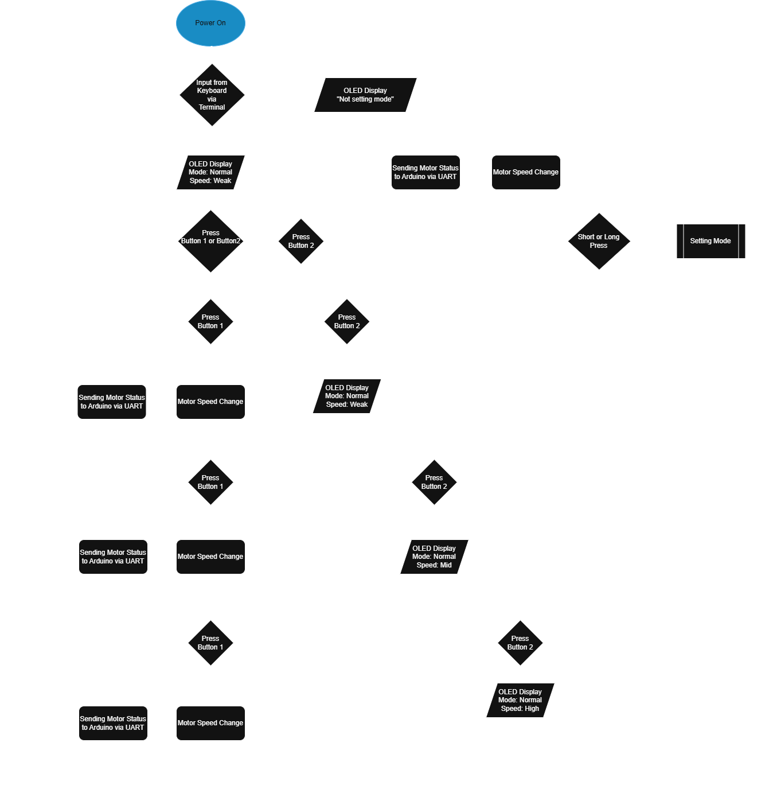

# TriSpeed_MotorX
STM32-based 3-speed DC motor controller with PWM, UART, and state logic

TriSpeed MotorX 是一個基於 STM32F446RE Nucleo 開發板的小型馬達控制專案，
實現了按鈕切換三段轉速、OLED即時顯示當前狀態，並透過 UART 通訊將速度資訊同步給 Arduino，控制 RGB LED 顏色變化。

# 系統架構
## STM32 X Arduino X UART X PWM X OLED 系統架構圖

## Normal Mode 流程圖

## Setting Mode 流程圖

# 使用方式

環境準備
1. 開啟 STM32CubeIDE
參考 STM32/ 資料夾內的 main.c 與 .ioc 設定，燒錄至 Nucleo-F446RE 開發板。

2. 開啟 Arduino IDE
參考 Arduino/ 資料夾內的 .ino 檔案，燒錄至 Arduino Uno R3。

3. 接線參考
請依據 images/ 資料夾內的接線圖進行連接，特別注意以下幾點：

注意事項
1. STM32 使用 +3.3V，Arduino 為 +5V, 
STM32 TX 可直接接 Arduino RX, 
Arduino TX 請透過電阻分壓後再接 STM32 RX（避免超壓損壞）

2. L298N 馬達模組使用 6 顆 AA 電池獨立供電, 
電池盒負極、模組負極、STM32 和 Arduino 皆需「共地」

3. 按鈕設有防彈跳電路，LED 有限流電阻, 
詳細接線請參見 images/ 接線圖

測試流程建議

1. 確認接線無誤並燒錄韌體

2. 按鈕1 測試三段速度循環是否正確

3. 按鈕2 測試 Reset 功能與Setting Mode切換

4. 使用 UART 終端機測試Setting Mode下的數字指令（0~3）

5. 確認 OLED 顯示與 RGB 燈變化與馬達一致

# 功能說明

1. 三段轉速切換（弱、中、強）=> 按鈕1：短按依序切換 弱 ➔ 中 ➔ 強

2. Reset 與 Setting Mode => 按鈕2：短按重設為弱速、長按進入設定模式（馬達停止）

3. 設定模式 UART 控制 => Setting下，可透過 UART 傳送數字指令 (0, 1, 2, 3) 切換馬達轉速

4. OLED 顯示 => 顯示目前模式（Normal / Setting）與轉速狀態（Stop / Weak / Mid / High）

5. UART 傳送至 Arduino 控制 RGB LED => 將目前狀態傳送至 Arduino，控制 RGB 燈顏色變化

# 使用技術與工具

**IDE**: 

1. STM32CubeIDE
   
2. Arduino IDE

**Hardware**: 

1. STM32F446RE Nucleo Board x1
 
2. Arduino Uno x1
 
3. OLED (SSD1306) x1
 
4. L298N Motor Driver Module x1
 
5. DC Motor(F130 Type) x1
 
6. RGB LED Module(HW-479) x1
 
7. LED(White) x1
 
8. Push Button x2
 
9. 6xAA Battery Holder x1

10. Resistors:
    – 330 Ω ×1
    – 1 kΩ ×1
    – 2 kΩ ×1
    – 10 kΩ ×2

11. Capacitors:
    – 104 Ceramic Capacitor (0.1 µF) ×2

12. Breadboard ×1

13. Jumper Wires: Male-to-Male, Male-to-Female (Depending on connection)

**Software**:

1. Realterm

**Knowledge:**

1. PWM 控制直流馬達轉速
   
2. 按鈕消除彈跳
 
3. UART通訊
 
4. C Programming Language

# 開發過程重點

1. 實作軟體與電路層級的去彈跳機制，有效避免按鈕誤觸。

2. 導入狀態機（State Machine）架構，實現模式與速度的穩定切換。

3. 透過分壓電路解決不同開發板間 UART 通訊的電壓相容問題。

4. 使用 OLED 即時顯示當前模式與馬達狀態，並可透過終端機進行遠端操作與控制。

***所有零件皆為常見開發模組，適合初學者搭建與測試***

# 成果展示

點擊下方觀看實際操作影片，展示三段轉速切換、OLED 顯示與 UART 控制 RGB LED：

> 實體操作按鈕切換弱 / 中 / 強速  
> OLED 即時顯示控制模式與速度狀態  
> RGB LED 隨 UART 指令變色同步展示

實體接線圖

# 授權
***本專案以 MIT License 授權開源使用。***
